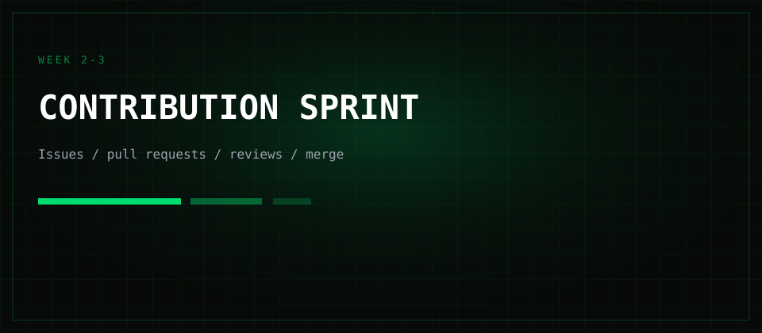

## About

FOSS Month is a month-long, fully online open-source contribution event for students.

Students list projects they maintain or want to grow. Contributors from the community pick issues, open pull requests, and ship improvements together.

No travel, no venue fees — just GitHub, Discord, and a shared calendar.

## Schedule

- **Week 1** — Project listing & contributor onboarding
- **Week 2–3** — Contribution sprint (issues, PRs, reviews)
- **Week 4** — Showcase demos and wrap-up

Exact dates will land in the community calendar before kickoff.

## Rules

- Open to students and early-career contributors worldwide.
- Teams may be up to four people; solo contributors are welcome.
- All work must be openly licensed and submitted via pull requests.
- Be kind. Follow the ONLY FOSS Code of Conduct.
- Maintainers decide what merges; quality over spam.

## Prizes

### Top contributor
Recognition plus community shout-outs for the most impactful merged contributions.

### Best student project
Spotlight for the student-listed project that attracted the strongest collaboration.

### Community choice
Voted by participants for the most helpful review, mentorship, or unblock.

## Rewards

### Swag & shout-outs
Stickers, digital badges, and featured spots on ONLY FOSS channels for active participants.

### Mentorship hours
Selected contributors get a short pairing session with maintainers after the month ends.

## Judges

### Maintainers panel
Project maintainers who listed repos during Week 1 review contribution quality and impact.

### Community mentors
Experienced FOSS contributors help score demos and surface standout collaboration.

## Important notes

- This page is draft placeholder copy for layout review — dates and prizes may change.
- Communication happens on Discord; GitHub is the source of truth for code.
- Timezone for announcements defaults to Asia/Kolkata unless noted otherwise.

## FAQ

### Who can join?
Any student or early-career contributor interested in open source. You do not need prior FOSS experience.

### Do I need my own project?
No. You can contribute to projects listed by others. Students who want help can list a project in Week 1.

### Is it fully online?
Yes. Everything runs remotely — async by default, with optional live sessions.

### How do I register?
Use the Express interest button above, or email onlyfoss.org@gmail.com with the subject “FOSS Month interest”.

## Contact

Questions or want to list a project? Email [onlyfoss.org@gmail.com](mailto:onlyfoss.org@gmail.com) or reach us on Discord via the Community page.
